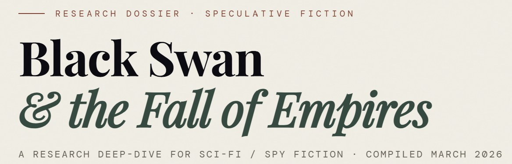
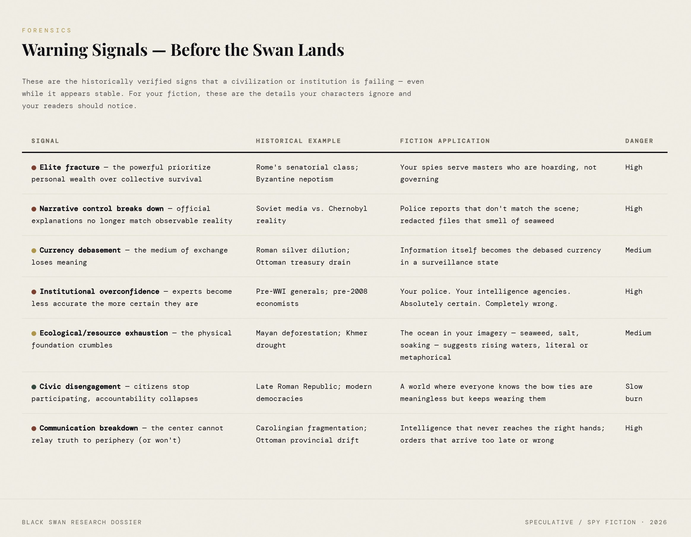
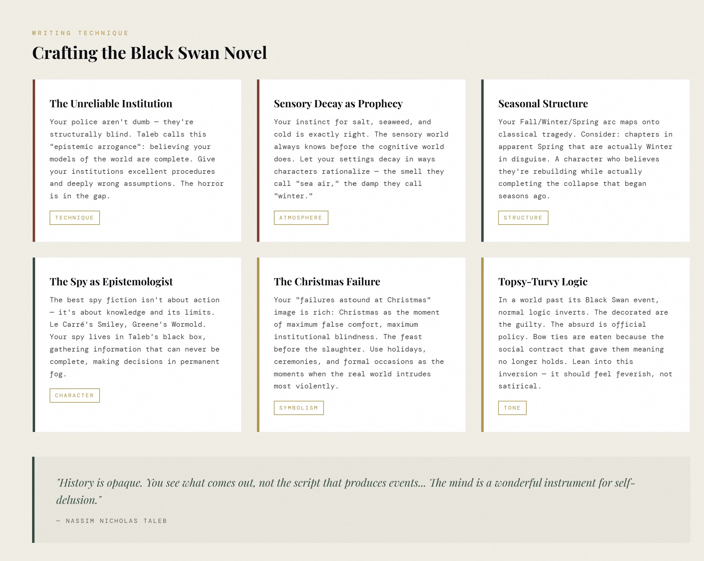

<h1 align="center">Claude.AI Black Swan Novella</h1>

<a align="center" href="https://claude.ai/?redirect=claude.com&via=cookie" ></img></a>

## Description:

Here's your interactive research dossier — five tabbed sections built around your story's core themes:
     - The Theory breaks down Taleb's framework, including the Turkey Problem and Extremistan vs. Mediocristan — the conceptual engine your world runs on.
    - Empire Collapse gives you a five-stage timeline (with fiction callouts for each stage) plus a specific decode of your Ottoman reference.
    - Warning Signals is a table of historically verified pre-collapse indicators, each mapped to imagery from your premise — the seaweed, the ceremonies, the institutional blindness.
    - Fiction Craft covers technique: how to write structurally blind institutions, use sensory decay as prophecy, and comparable works (le Carré, Pynchon, Le Guin) that live in similar territory.
    - Writer's Checklist is interactive — click each item as you develop your draft, with a progress bar tracking your worldbuilding.
    - The through-line across all of it: a Black Swan is unpredictable before it happens, carries massive impact, and gets explained as inevitable only after the fact Internet Archive — which is exactly the gap your story lives in, between what the institutions believe and what is actually coming for them.

## Technology Stack
- **Frontend/Client:** React.js, HTML5, Claud.ai

## Screen Shots:

Please reference the screenshot folder for more available images

<a align="center"></img></a>

<a align="center"></img></a>

## Contact:
<!--- You can add in your linkedin, medium, stack overflow, dev.to account, etc. here --->
If you want to contact me you can reach me at <nelson@oakhalo.com>.

Connect with me on <a href="https://www.linkedin.com/in/ayla-nelson/">LinkedIn</a>

Connect with me on <a href="https://github.com/oakHalo">Oakhalo.dev</a>

## Resources:

- **Claude.AI** for API Tests [here](https://claude.ai/new)
    - Claude is a series of large language models (LLMs) developed by Anthropic, an AI research company co-founded by former OpenAI executives. Named after Claude Shannon, the pioneer of information theory, the assistant is built using Constitutional AI, a training methodology designed to make it more helpful, honest, and harmless.
    - Current Model Lineup (as of early 2026)
- **[Anthropic](https://www.anthropic.com/)** typically releases its models in three distinct sizes to balance performance, speed, and cost: 
    - Claude Opus (4.6): The most capable model, optimized for complex reasoning, coding, and professional enterprise agents.
    - Claude Sonnet (4.6): The mid-tier model designed for high-scale performance in coding and enterprise workflows.
    - Claude Haiku (4.5): The fastest and most cost-effective model, suitable for near-frontier intelligence at speed

#### **helpful hint:** 
- `useful hints for future projects to go faster`
- console log testing with `ctr-alt-l` 
- Always Stay Positive & Triple Check Permissions :)

<!-- 
### TODO stx: 
Future Structure (stx):
backend
frontend
images
screenShots [contains video link]
troubleShooting [contains issues resolved]

-->
